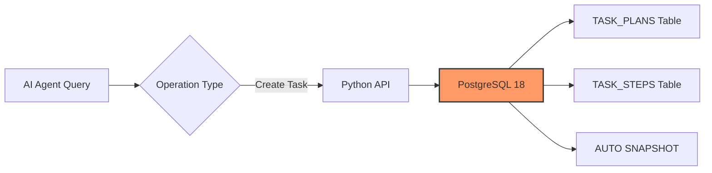
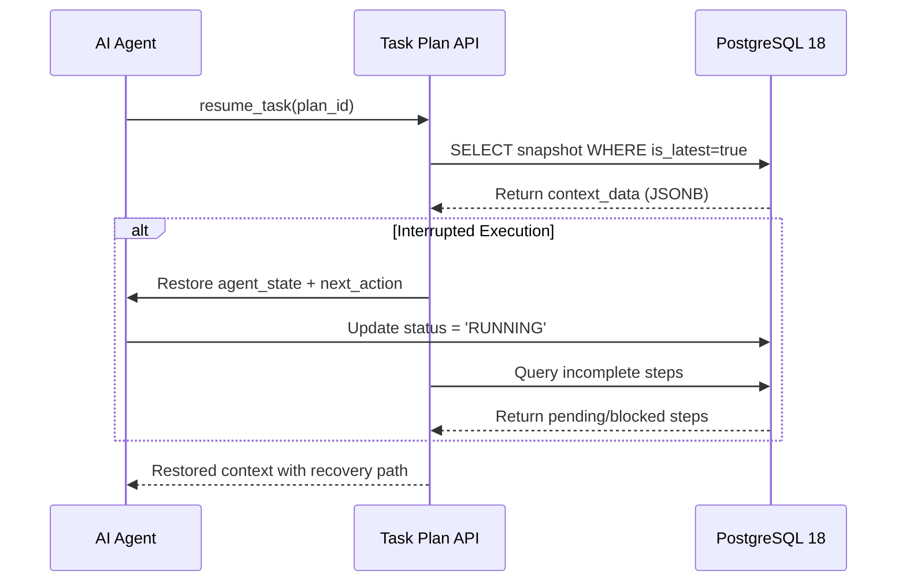

# memory-pg18-by-yhw v0.3.2 Task Plan Integration Edition

[GitHub Repository](https://github.com/Haiwen-Yin/memory-pg18-by-yhw) · [SKILL.md](SKILL.md) · [RELEASE_NOTES_v0.3.2.md](RELEASE_NOTES_v0.3.2.md)

AI Agent Memory System with PostgreSQL 18 + Apache AGE + pg-embedding-gen-by-yhw + Task Plan Persistence

**Version**: v0.3.2  
**Author**: Haiwen Yin (胖头鱼 🐟) - Database Expert  
**Date**: 2026-05-04 CST  
**License**: Apache License 2.0

---

## 🎯 **Executive Summary**

This is the **v0.3.2 Task Plan Integration Edition** - an upgrade from v0.3.1 that introduces critical AI Agent capabilities:
- ✅ **Task Plan Persistence** - Durable task tracking across sessions
- ✅ **Breakpoint Recovery** - Resume exactly where interrupted after failures
- ✅ **Historical Learning** - Learn from past task patterns and outcomes

---

## 📊 v0.3.1 vs v0.3.2 Feature Comparison

| Feature | v0.3.1 | **v0.3.2** |
|---------|--------|-----------|
| **Target Users** | All AI Agents | ✅ All AI Agents |
| **Embedding Models** | Multi-model | ✅ Multi-model |
| **Property Graph** | AGE Integration | ✅ Full Cypher Support |
| **Vector Search** | pgvector HNSW | ✅ Optimized Indexing |
| **Task Plan Storage** | ❌ Not included | ✅ **Complete Task Plan System** |
| **Breakpoint Recovery** | ❌ None | ✅ **Auto Snapshot + Resume API** |
| **Historical Learning** | ❌ Limited | ✅ **Task Pattern Recognition** |

---

## 🆕 v0.3.2 New: Task Plan Persistence System

### Overview

The Task Plan system provides AI Agents with durable task execution tracking, enabling:
- **Breakpoint recovery after failures** - Resume exactly where interrupted with full context
- **Historical pattern learning from completed tasks** - Learn from past success/failure modes
- **Detailed status auditing** - Complete audit trail of all agent actions

### Quick Start

```bash
# 1. Deploy Task Plan schema (NEW in v0.3.2)
psql -U postgres -d memory_graph -f scripts/init_task_plan_system.sql

# 2. Import Python API
from scripts.task_plan_api import create_task_plan, resume_task, search_completed_tasks

# 3. Create task plan with auto-snapshot
plan = create_task_plan(
    plan_name="Deploy Database Migration",
    plan_type="deployment",
    goal={"objective": "Migrate schema changes safely"}
)

# 4. Resume from breakpoint (if agent was interrupted)
context = resume_task(plan_id=plan['plan_id'])
```

### Task Plan Architecture

```
┌──────────────────────────────────────────────────────┐
│                   AI Agent Task Execution            │
└──────────────────────────────────────────────────────┘

[Agent] ──Start Task──► [create_task_plan()]
                         │
                  ┌──────▼───────┐
                  │ TASK_PLANS   │ ← Task plan (status, goals)
                  └──────┬───────┘
                         │
                  ┌──────▼───────┐
                  │ TASK_STEPS   │ ← Execution steps and results
                  └──────┬───────┘
                         │
              [Executing...] ──► [update_task_progress()]
                              │
                       ┌──────▼──────────┐
                       │ ONTEXT_SNAPSHOTS│ ← **Critical for breakpoint recovery**
                       └──────┬──────────┘
                              │
                    ┌─────────▼─────────┐
                    │  AGENT_STATE      │ ← Agent current state
                    │  CONVERSATION     │ ← Conversation history
                    │  NEXT_ACTION      │ ← Next action
                    │  MEMORY_IDS       │ ← Associated memory nodes
                    └───────────────────┘

[Exception/Interruption] ◄──► [resume_task()] ──► [Load latest snapshot to continue execution]
```

### Database Schema (Task Plan System)

Five new tables for task persistence:

| Table | Purpose | Key Columns |
|-------|---------|-------------|
| `task_plans` | Core plan management | plan_id, status, goal(JSONB), priority |
| `task_steps` | Step execution tracking | step_order, action, tools_used(JSONB) |
| `task_context_snapshots` | Breakpoint recovery state | context_data(JSONB), is_latest(BOOLEAN), next_action |
| `task_tool_calls` | Tool call audit trail | tool_name, action, duration_ms |
| `task_dependencies` | Task dependency graph | source_plan_id, target_plan_id, condition(JSONB) |

---

## 📋 **Quick Start**

### Prerequisites

1. **PostgreSQL 18** (Required)
   - Must support pgvector and Apache AGE extensions
   - Download from [PostgreSQL](https://www.postgresql.org/download/)

2. **Python 3.8+** (Required for Task Plan API)
   ```bash
   python3 --version
   pip install psycopg2-binary
   ```

---

## 🚀 **Installation**

### Step 1: Install PostgreSQL 18 with Extensions

For Ubuntu/Debian systems:
```bash
# Install PostgreSQL 18 and extensions
sudo apt update && sudo apt install postgresql-18 -y
sudo apt install postgresql-18-vector postgresql-18-age -y

# Start PostgreSQL service
sudo systemctl start postgresql@18-main
sudo systemctl enable postgresql@18-main
```

For CentOS/RHEL systems:
```bash
# Add PostgreSQL repository (example for RHEL 9)
curl https://download.postgresql.org/pub/repos/yum/reporpms/EL-9-x86_64/postgresql-pgdg-redhat-repo-latest.noarch.rpm | sudo rpm -Uvh

# Install PostgreSQL 18 with extensions
sudo yum install postgresql18-server postgresql18-vector postgresql18-age -y

# Initialize and start PostgreSQL
sudo /usr/pgsql-18/bin/postgresql-18-setup initdb
sudo systemctl enable --now postgresql-18.service
```

### Step 2: Create Database and Schema

Create the database if it doesn't exist:
```bash
psql -U postgres -c "CREATE DATABASE memory_graph;"
```

Deploy all schema components:
```bash
# Original memory system (v0.3.1)
psql -U postgres -d memory_graph -f scripts/init_memory_system.sql

# Task plan persistence (NEW v0.3.2)
psql -U postgres -d memory_graph -f scripts/init_task_plan_system.sql
```

### Step 3: Use Python API for Task Management

```python
from scripts.task_plan_api import create_task_plan, resume_task

# Create task with auto-snapshot on creation
plan = create_task_plan(
    plan_name="Deploy Production Database",
    plan_type="deployment",
    description="Execute zero-downtime migration with rollback capability",
    goal={
        "objective": "Migrate schema changes safely without downtime",
        "risk_level": "high",
        "rollback_required": True,
        "estimated_duration_minutes": 45
    },
    steps=[
        {"order": 1, "name": "Backup current state"},
        {"order": 2, "name": "Execute migration script"},
        {"order": 3, "name": "Run validation queries"},
        {"order": 4, "name": "Update documentation"}
    ]
)

print(f"Created task: {plan['plan_id']} - {plan['plan_name']}")

# If agent was interrupted and needs to resume
context = resume_task(plan_id=plan['plan_id'])
if context.get('incomplete_steps'):
    print(f"Resuming from step: {context['next_action']}")
```

---

## 📊 **System Architecture Overview**

### Component Layers

| Layer | Component | Description |
|-------|-----------|-------------|
| **Application** | AI Agents | All AI agents using memory system via Python API |
| **Interface** | Task Plan API | PostgreSQL connection layer for all operations |
| **Storage** | JSONB Tables | Structured storage with native indexing |
| **Graph** | Property Graph | Apache AGE with Cypher query support |

### Data Flow Architecture

#### Write Operations (Task Creation)



#### Breakpoint Recovery Flow



---

## 🗄️ **Database Schema**

### Original Memory System Tables (v0.3.1 - Unchanged)

```sql
-- Memory nodes (vertices for Property Graph)
CREATE TABLE memory_nodes (
    node_id      SERIAL PRIMARY KEY,
    label        VARCHAR(100),
    node_type    VARCHAR(50),
    properties   JSONB,           -- Properties stored as JSONB
    embedding    VECTOR(1024)     -- BGE-M3 embedding
);

-- Memory edges (edges for Property Graph)  
CREATE TABLE memory_edges (
    edge_id      SERIAL PRIMARY KEY,
    source_node  INTEGER REFERENCES memory_nodes(node_id),
    target_node  INTEGER REFERENCES memory_nodes(node_id),
    edge_type    VARCHAR(100),
    properties   JSONB            -- Properties stored as JSONB
);

-- Core memories table
CREATE TABLE memories (
    id           SERIAL PRIMARY KEY,
    content      TEXT,
    memory_type  VARCHAR(100),
    category     VARCHAR(100),
    priority     INTEGER,
    created_at   TIMESTAMPTZ DEFAULT CURRENT_TIMESTAMP,
    updated_at   TIMESTAMPTZ,
    expires_at   TIMESTAMPTZ,
    tags         JSONB,           -- Array of tags as JSONB
    metadata     JSONB            -- Metadata object as JSONB
);

-- Vector embeddings for memories
CREATE TABLE memories_vectors (
    id            SERIAL PRIMARY KEY,
    memory_id     INTEGER NOT NULL REFERENCES memories(id) ON DELETE CASCADE,
    embedding     VECTOR(1024),
    created_at    TIMESTAMPTZ DEFAULT CURRENT_TIMESTAMP,
    model_version VARCHAR(50) DEFAULT 'bge-m3'
);
```

### v0.3.2 New: Task Plan System Tables

```sql
-- See scripts/init_task_plan_system.sql for complete DDL
-- Key tables: task_plans, task_steps, task_context_snapshots, 
--             task_tool_calls, task_dependencies
```

---

## 🔧 **API Functions (Python Integration)**

### create_task_plan() - Create task plan and automatically save initial context snapshot

```python
def create_task_plan(plan_name, plan_type="task", description="", goal=None, steps=None):
    """
    Create a new task plan and automatically save initial context
    
    Args:
        plan_name (str): Task name
        plan_type (str): task/deployment/research/analysis  
        description (str): Task description
        goal (dict): Final goal (structured)
        steps (list[dict]): Step list [{order, name, action}, ...]
    
    Returns:
        dict: Created plan information
    """
```

### resume_task() - Resume task execution from breakpoint (core feature)

```python  
def resume_task(plan_id):
    """
    Resume task execution from breakpoint
    
    Args:
        plan_id (int): Plan ID
    
    Returns:
        dict: Restored context information including next_action, incomplete_steps
    """
    # 1. Get latest snapshot (is_latest = true)
    # 2. Restore agent_state and conversation_history from context_data
    # 3. Identify incomplete steps by checking step status  
    # 4. Resume execution with next_action as starting point
```

### search_completed_tasks() - Search completed tasks for learning and pattern reuse

```python
def search_completed_tasks(query_params=None):
    """
    Search completed tasks for learning and pattern reuse
    
    Args:
        query_params (dict): {type, status, tags, keywords, date_range}
    
    Returns:
        list[dict]: Matching task list with success metrics and statistics
    """
```

---

## 📚 **Documentation**

- [SKILL.md](./SKILL.md) - Skill definition and usage guide (v0.3.2)
- [README.md](./README.md) - This file (project documentation v0.3.2)
- [CHANGELOG.md](./CHANGELOG.md) - Complete version history and changes (v0.2.0 through v0.3.2)
- [RELEASE_NOTES_v0.3.2.md](./RELEASE_NOTES_v0.3.2.md) - Detailed release notes for v0.3.2

---

## 👨‍💻 **Author & Maintainer**

**Haiwen Yin (胖头鱼 🐟)**  
Oracle/PostgreSQL/MySQL ACE Database Expert

- **Blog**: https://blog.csdn.net/yhw1809
- **GitHub**: https://github.com/Haiwen-Yin

---

## 📄 **License**

This project is licensed under the Apache License, Version 2.0 - see the [LICENSE](LICENSE) file for details.

**Last Updated**: 2026-05-04 v0.3.2